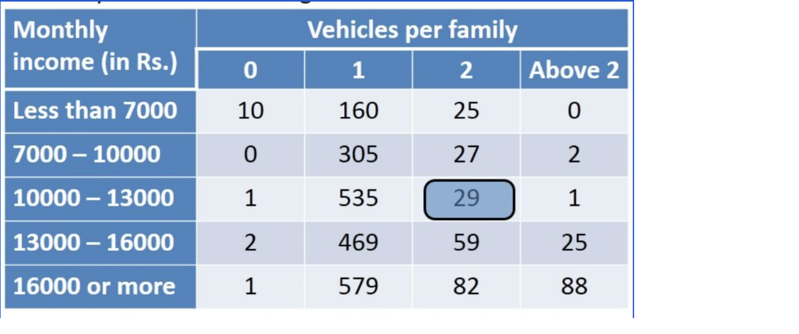

# Image Description

In this document you will find a few exercises for practicing image description. For each exercise, you'll get some input text and then an expected completion. Your task is to write the prompt to achieve the expected completion.

## Exercise 1: Helmet counter
Write a prompt that tells you the number of people wearing a helmet.

## Exercise 2: Pythagorean theorem
Write a prompt that solves the task in the picture.

## Exercise 3: Table Understanding and Reasoning
Write a prompt that tells you that 113 families are earning more than 13000 and own more than 2 cars.

